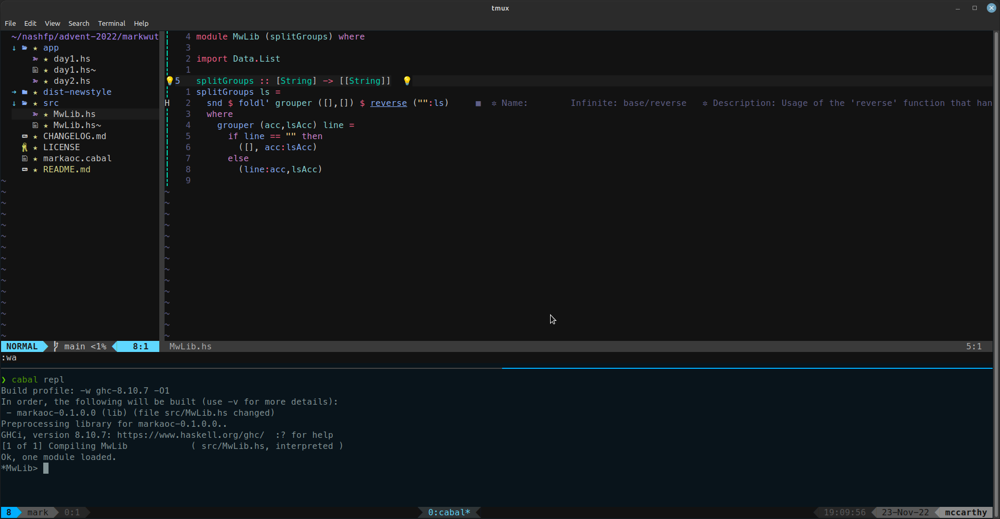

# Advent of Code 2022

Although I had thought about using Rust this year, I did a little
experimentation and decided that I would rather opt for a more
fun experience so I decided to go with Haskell.

Since we have been talking about learning how to set up Haskell
and use it, I am documenting the various steps I have taken to get
my environment going.

## Getting Started

### Installing Haskell and tools

To get Haskell installed, the easiest thing I know of is
[GHCUP](https://www.haskell.org/ghcup/). Once you install GHCUP
you can install GHC, the Haskell Language Server, and Cabal (the
package manager):

```
ghcup install ghc 9.4.3
ghcup install hls 1.8.0.0
ghcup install cabal 3.8.1.0
```

### Editing Environment

Most of the top choices for editing Haskell now can use the language
server. I have often used the Emacs integration, and I know that
there is pretty good support in VS Code. But, I am currently using
Neovim. I configured my environment using a series of videos by
Josean Martinez:

[How to make your boring Mac terminal so much better](https://www.youtube.com/watch?v=CF1tMjvHDRA)

While I did the above on my work Macbook, I also set up zsh on my Linux box using an identical configuration
and I installed the Meslo Nerd Font and set it as the font for my Gnome Terminal.

[How I setup Neovim on my Mac to make it amazing](https://www.youtube.com/watch?v=vdn_pKJUda8)

[How I use Tmux with Neovim for an awesome dev workflow on my Mac](https://www.youtube.com/watch?v=U-omALWIBos)

### Creating a new project

Assuming that's all working, you next want to create a new project. I
created the markwutka+haskell directory and then did:

```
cabal init --libandexe
```

The `--libandexe` tells cabal to create a `src` directory for library
files, which would contain general utilities that might be useful
for multiple days in Advent of Code, and then an `app` directory
where I will put each day's program. Also, when cabal asked me the
name of the project I entered "markaoc" instead of the default
which would be the directory name (`markwutka+haskell`). The main reason
is that you can't have a + in the package name, but also markaoc is
shorter. I mostly took the defaults on everything else, chose ISC as
the license, and I opted to not generate a test suite.

Finally, I renamed `app/Main.hs` to `app/day1.hs` and changed the part of
`markaoc.cabal` where it specifies the executable so it looks like this:

```
executable day1
    import:           warnings
    main-is:          day1.hs
    build-depends:
        base ^>=4.14.3.0,
        markaoc
    hs-source-dirs:   app
    default-language: Haskell2010
```

Now, each day, I will just duplicate this declaration and change day1 to
whatever day it is. To build the day1 executable I can do:

```
cabal build day1
```

To run it, I use `cabal run` and after the name of the executable I
want to run and any command-line arguments. For example,
if I want to pass an input filename like day1.txt, I can do this:

```
cabal run day1 data/day1.txt
```

### Vim & Tmux Flow

While there may be easier ways to do this, I create two Tmux windows and run Neovim in one and do `cabal repl` in the
other. The `cabal repl` command gives me a Read-Eval-Print-Loop that I can use to try out my Haskell functions.
When I make changes to the source code, I can do `:reload` from the REPL to load the most recent versions of my
source files. This is what my terminal looks like:

